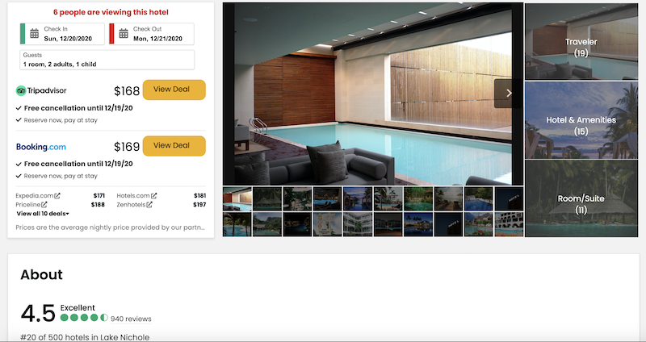
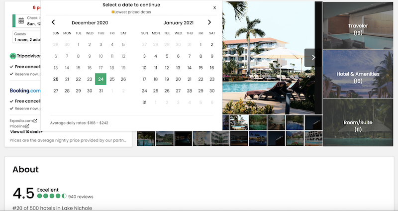
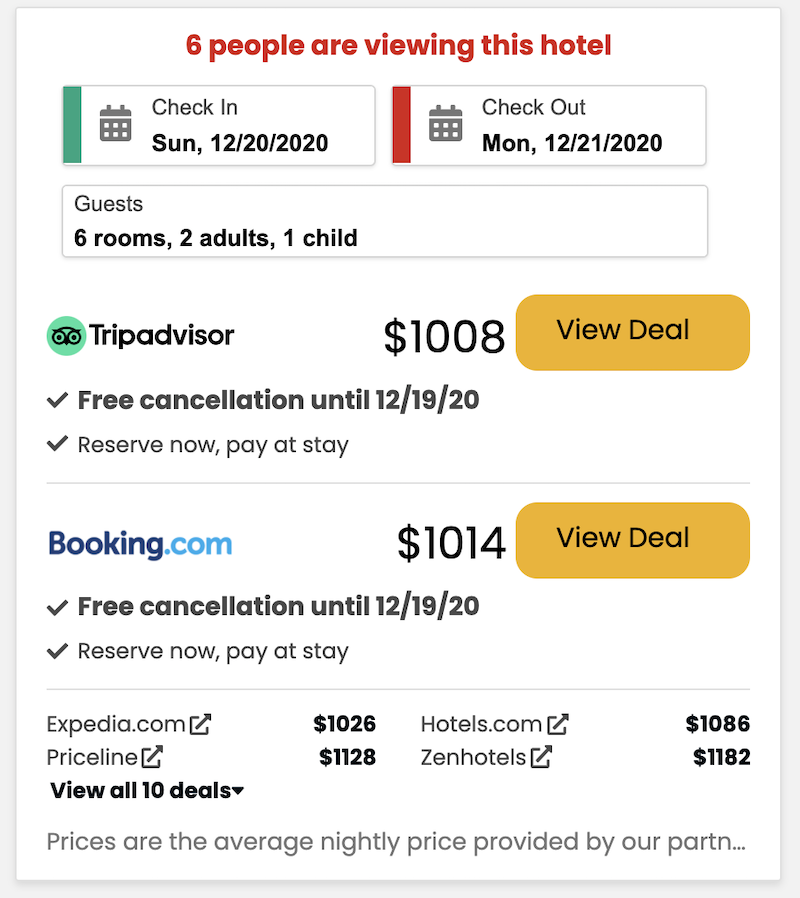
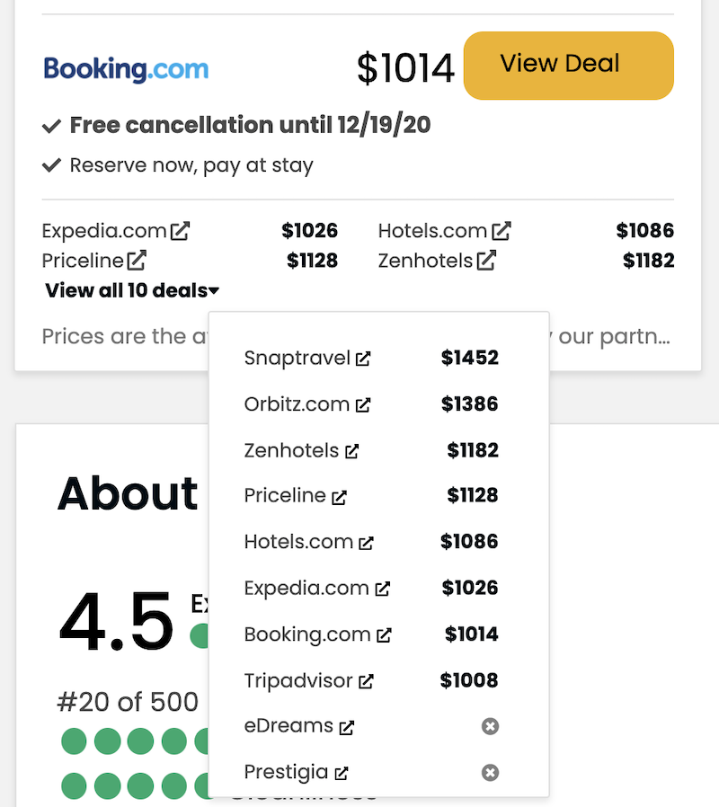
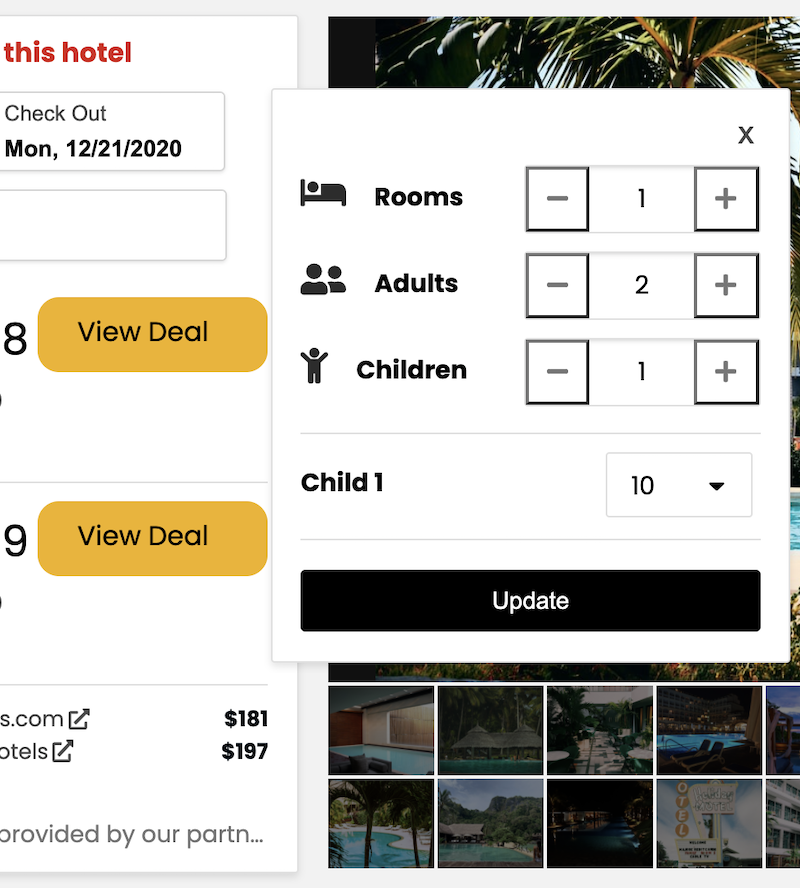
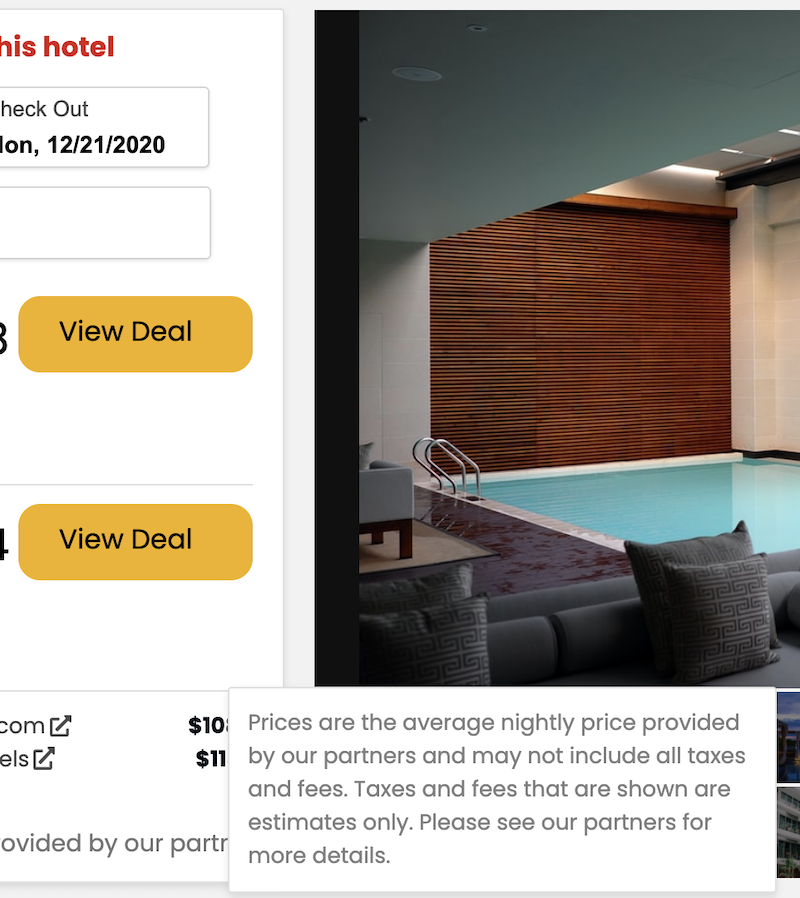

# Calendar microservice of HotellMe app
## Table of Contents

  - [Table of Contents](#table-of-contents)
  - [Description](#description)
  - [Gifs](#gifs)
  - [Screenshots](#screenshots)
  - [Video](#video)
  - [Installation](#installation)
  - [Related Projects](#related-projects)
  - [License](#license)


## Description
Calendar microservice of HotellMe full-stack web application for booking hotel rooms. Extended functionality helps users not only pick desired dates with a custom-built availability calendar, but also displays average rates and hot deals from a number of world-famous travel aggregators (e.g. Expedia, Booking, Tripadvisor etc.). Users can specify the desired number of rooms and number of people visiting the place. Microservice will automatically check room availability, compare prices and display best deals.

## Gifs

<p float="left">
  <div style="border:1px solid black">
    
  </div>
</p>

## Screenshots

<p float="left">
  
  
</p>

<p float="left">
  
  
</p>

<p float="left">
  
  
</p>

## Video
demo video on [Youtube](https://youtu.be/7Sh_2GsaL0s)

## Installation

1. clone this repository:

    ```
    git clone https://github.com/Hotellooo/calendar.git
    ```

2. go to /calendar folder:

    ```
    cd calendar
    ```

3. install dependencies:

    ```
    npm install
    ```

4. run mongoDB seeding script:

    ```
    npm run db-seed
    ```

5. create webpack production build:

    ```
    npm run build
    ```

6. start app server

    ```
    npm start
    ```

## Related Projects

  - [Proxy](https://github.com/Hotellooo/calendar-proxy)
  - [Photo-carousel](https://github.com/Hotellooo/photos-carousel)
  - [About](https://github.com/Hotellooo/about)
  - [Reviews](https://github.com/Hotellooo/reviews)

## License
[MIT](https://choosealicense.com/licenses/mit/)
